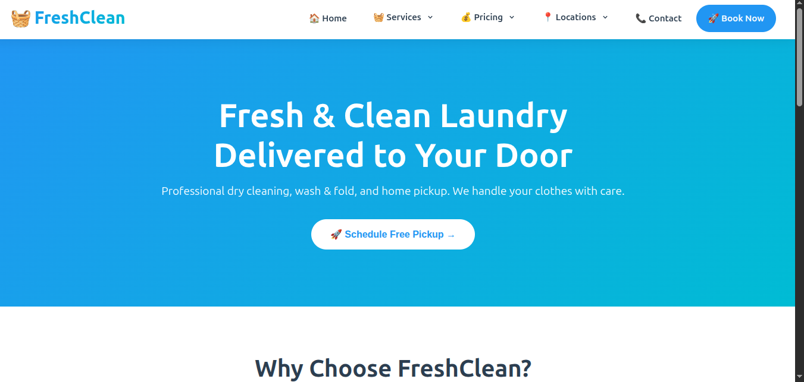
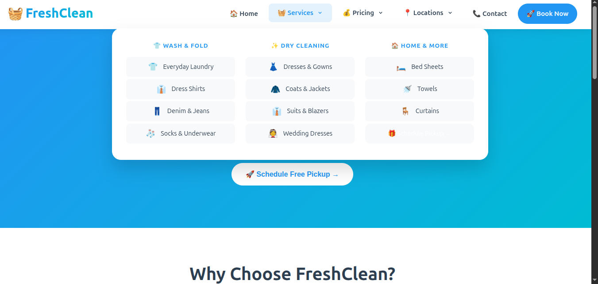
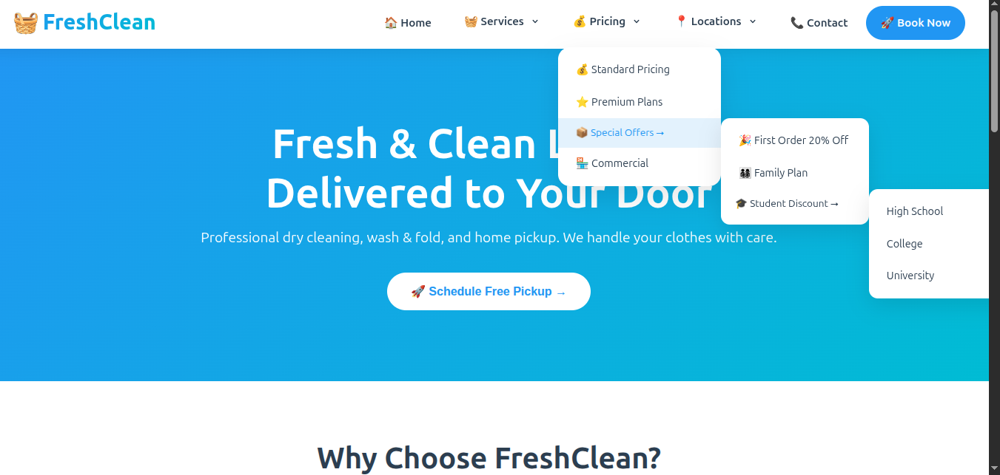
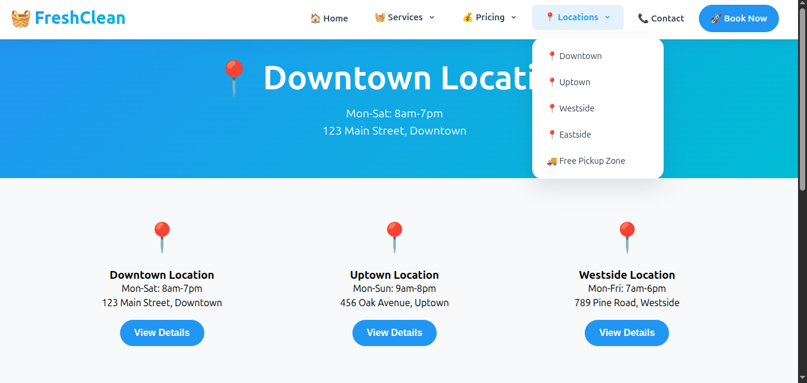
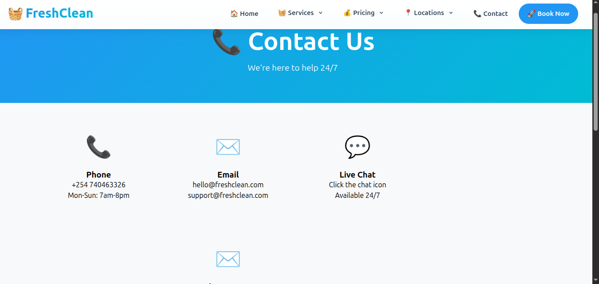

# 👕 FreshWash Laundry - Premium Laundry Service Platform

[](YOUR_LIVE_DEMO_LINK)
[](https://php.net)
[](https://mysql.com)
[](LICENSE)

> A modern, professional laundry service platform with online booking, payment integration, and real-time order tracking.

---

## 📸 Screenshots

### 🏠 Homepage


### 📱 Services Page


### 📄 Pricing Page


### 📍 Location Page


### 📧 Contact Page


---

## 📸 Screenshots Gallery

<details>
<summary>Click to view all screenshots</summary>

### 🏠 Homepage


### 📱 Services


### 💰 Pricing


### 📍 Location


### 📧 Contact


</details>

---

## 🚀 Live Demo

**🔗 [View Live Demo](http://michaelphotofolio.atwebpages.com)**

---

## ✨ Features

### 🧺 Customer Features
- **User Authentication** - Register, login, logout with secure password hashing
- **Service Booking** - Book laundry services online with date/time selection
- **Service Categories** - Wash, Dry Clean, Iron, Fold, and more
- **Pricing Calculator** - Get instant price estimates based on weight/items
- **Order Tracking** - Track your laundry status in real-time
- **Pickup & Delivery** - Schedule pickup and delivery times
- **Payment Integration** - M-Pesa, card, and cash payments
- **Order History** - View all past and current orders
- **Contact Form** - Send inquiries to support team
- **Newsletter** - Subscribe for updates and promotions
- **Location Finder** - Find nearest laundry service location

### 👑 Admin Features
- **Dashboard Overview** - View key metrics (orders, revenue, customers)
- **Order Management** - Update order status (pending, processing, completed, delivered)
- **Service Management** - Add, edit, delete services
- **Price Management** - Update pricing for different services
- **User Management** - View and manage customer accounts
- **Contact Messages** - View and reply to customer inquiries
- **Revenue Reports** - Track earnings and generate reports

### 🎨 Design Features
- **Modern UI** - Clean, professional design with brand colors
- **Responsive Design** - Works on all devices (desktop, tablet, mobile)
- **Interactive Elements** - Hover effects, animations, smooth scrolling
- **Fast Loading** - Optimized images and code
- **Accessibility** - WCAG-friendly design
- **Professional Layout** - User-friendly interface

---

## 🛠️ Technologies Used

### Backend
- **PHP 8.0+** - Server-side scripting
- **MySQL** - Database management
- **PDO** - Secure database connections

### Frontend
- **HTML5** - Semantic markup
- **CSS3** - Custom styling
- **JavaScript** - Interactive elements
- **Bootstrap 5** - Responsive framework (optional)

### Payment Integration
- **M-Pesa** - Mobile money payments
- **Stripe** - Card payments (optional)

---

## 📦 Installation Guide

### Prerequisites
- PHP 8.0 or higher
- MySQL 5.7 or higher
- Web server (Apache/Nginx)
- Composer (optional)

### Step 1: Clone the Repository
```bash
git clone https://github.com/yourusername/laundry-website.git
cd laundry-website
